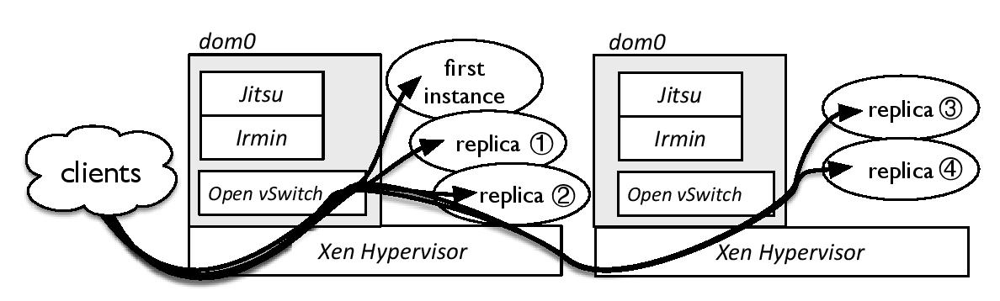

# Fractal: Automated Application Scaling #

*Fractal is experimental software. See [LICENSE](#license) for conditions.*

Fractal is an extension to and an API over the [Jitsu platform](https://github.com/mirage/jitsu). It extends the Jitsu control stack on the dom0 through a simple RPC API which allows simple, dy-
namic, programmable creation and destruction of service replicas over the cloud infrastructure from within the service. This enables such decisions to be taken at whatever granularity and based on whatever metrics the developer sees fit. Fractal implements network-based load balancing using the OpenFlow protocol as exposed by the Open vSwitch softswitch running in the dom0 of the XenServer.

## Installing Fractal ##
TBD.